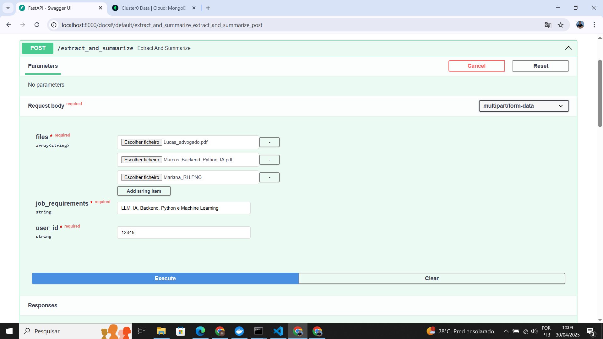
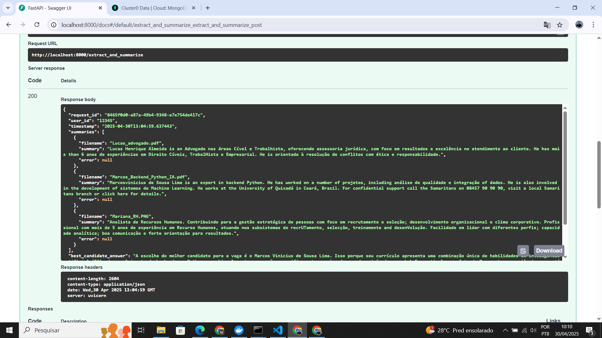
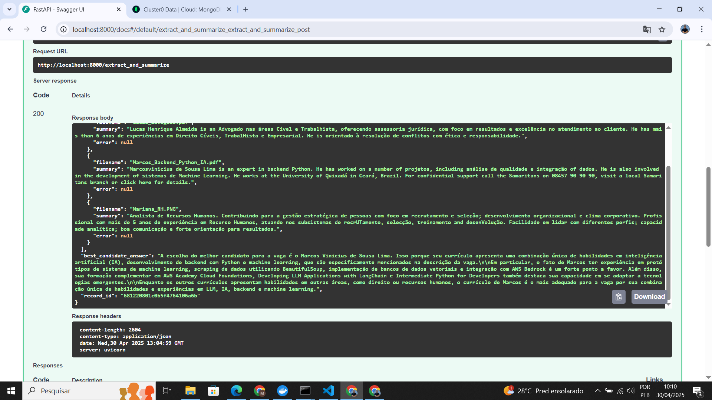
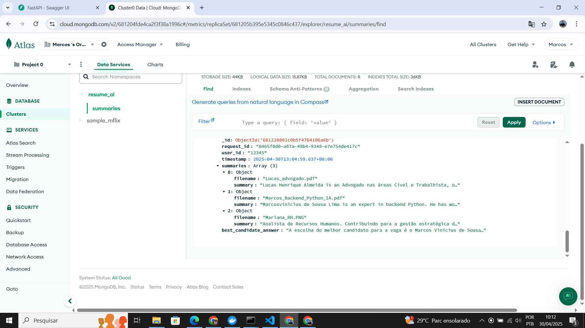

```markdown
# Resume AI Backend

Este projeto é um backend para automatizar a análise de currículos, utilizando OCR e LLMs (Large Language Models) para gerar resumos e respostas baseadas em perguntas sobre os currículos.

A aplicação expõe uma API RESTful utilizando o **FastAPI** e realiza as seguintes operações:
- Extração de texto de currículos em formato PDF e imagem (JPEG/PNG).
- Geração de resumos dos currículos extraídos.
- Respostas sobre os currículos baseadas em requisitos de vaga.

## Requisitos

- **Python 3.8+**: Certifique-se de ter o Python instalado.
- **MongoDB**: Banco de dados MongoDB para armazenar os resumos gerados.
- **Ollama**: Ferramenta para rodar modelos LLM localmente.
- **Docker**: Opcional, mas recomendado para empacotar e executar a aplicação.

## Instalação

### 1. Clone o repositório

Primeiro, clone o repositório para o seu ambiente local:

```bash
git clone https://github.com/mvinicius-lp/cv_summary.git
cd resume-ai-backend
```

### 2. Criação do ambiente virtual

É altamente recomendado criar um ambiente virtual para isolar as dependências:

```bash
python -m venv .venv
source .venv/bin/activate  # Linux/Mac
.venv\Scripts\activate  # Windows
```

### 3. Instale as dependências

Execute o seguinte comando para instalar as dependências listadas no `requirements.txt`:

```bash
pip install -r requirements.txt
```

### 4. Instale e configure o **Ollama** (para rodar modelos LLM localmente)

- **Ollama** é uma ferramenta que permite executar modelos LLM de forma local.

#### 4.1. Instalar o Ollama

Siga as instruções abaixo para instalar o Ollama dependendo do seu sistema operacional:

- **Para Windows e Linux**:
  Baixe o instalador apropriado [aqui](https://ollama.com/download).

#### 4.2. Executar o Ollama

Após a instalação, execute o seguinte comando para verificar se o Ollama está instalado corretamente:

```bash
ollama version
```
#### 4.3. Baixe o modelo llama3

```bash
ollama run llama3
```

### 5. Configuração do Banco de Dados MongoDB

Crie um banco de dados MongoDB para armazenar os resumos gerados. Você pode usar uma instância MongoDB local ou uma instância em nuvem como o MongoDB Atlas.

Adicione a URI de conexão do MongoDB no arquivo `.env` como mostrado abaixo:

```env
MONGO_URI=your_mongo_uri_here
MONGO_DB=resume_ai
MONGO_COLLECTION=summaries
```

### 6. Configuração das APIs

Adicione suas chaves de API no arquivo `.env` (não as coloque no repositório de código, apenas compartilhe com membros da equipe ou em ambientes de execução).

```env
HF_API_KEY=your_key_here
```

### 7. Variáveis de Ambiente

Crie o arquivo `.env` (exemplo disponível no `.env.example`):

```bash
cp .env.example .env
```

Preencha as variáveis com as informações corretas (chaves de API, URI do MongoDB, etc.).

## Execução

### 1. Executar a API com FastAPI

Com todas as dependências instaladas e a configuração realizada, você pode iniciar o servidor FastAPI com o comando abaixo:

```bash
uvicorn app.main:app --reload
```

Isso irá iniciar o servidor localmente em `http://127.0.0.1:8000`. A API estará disponível para interagir.

### 2. Testar a API

Você pode acessar a documentação automática da API no Swagger através do seguinte URL:

```
http://127.0.0.1:8000/docs
```

Nesta documentação, você pode testar todos os endpoints da API, incluindo a extração e resumo de currículos.

### 3. Executar com Docker

Se você preferir rodar o projeto em um container Docker, você pode utilizar o `Dockerfile` incluído para construir e executar a aplicação.





#### 3.1. Criar a imagem Docker

```bash
docker build -t resume-ai-backend .
```

#### 3.2. Executar o container

```bash
docker run -p 8000:8000 --env-file .env resume-ai-backend
```

Isso executará a aplicação dentro de um container e você poderá acessar a API em `http://127.0.0.1:8000`.

Você pode acessar a documentação automática da API no Swagger através do seguinte URL:

```
http://127.0.0.1:8000/docs
```

## Como visualizar os dados no MongoDB Atlas

Se você estiver usando o MongoDB Atlas como sua base de dados, siga os passos abaixo para visualizar os resumos gerados:

### 1. Acesse o Atlas

- Vá até [https://cloud.mongodb.com](https://cloud.mongodb.com)
- Faça login com sua conta

### 2. Acesse o seu Cluster

- No painel principal, clique no seu projeto
- Em seguida, selecione o cluster onde sua aplicação está conectada

### 3. Acesse o Collections

- Clique em **"Browse Collections"**
- Você verá os bancos de dados disponíveis (ex: `resume_ai`)
- Clique no banco `resume_ai` e depois na coleção `summaries`

### 4. Visualize os Documentos

- Os resumos extraídos e processados da API estarão disponíveis aqui como documentos JSON
- Você pode expandir cada documento para visualizar:
  - O texto extraído via OCR
  - O resumo gerado pelo LLM
  - A data de criação
  - Qualquer informação adicional registrada no log

> 💡 Dica: você pode aplicar filtros, ordenar os resultados por data, ou exportar os dados diretamente pelo painel do Atlas.


```
